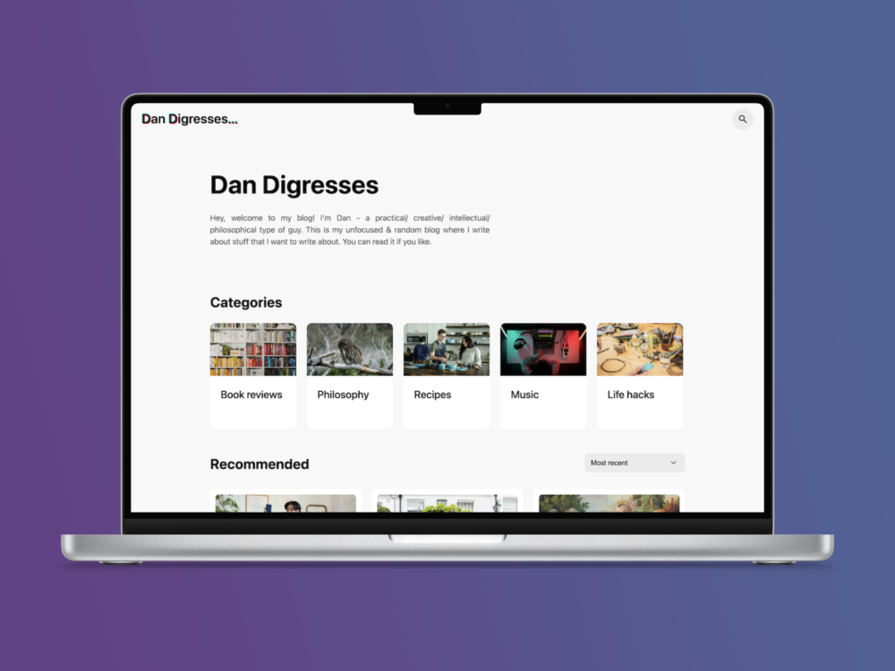

**A personal blog inspired by [TikTok Creator Academy](https://www.tiktok.com/creator-academy), which has a modern and fun style with big flashes of colour. Weirdly, the original site is not responsive - if you view on a mobile, it has a massive horizontal scroll bar because the header stays exactly the same.**

## Technologies

- WordPress
- PHP
- SASS

# Current task

- [ ] Truncate article titles on article previews & breadcrumbs

## To-Do List

- [ ] Style the search bar
- [ ] Add scroll snapping to horizontal categories bar
- [ ] Fix Jane Eyre article
- [ ] 404 error page
- [ ] Link privacy policy and terms of service pages
- [ ] Generate recent/relevant article dynamically
- [ ] Make H1 font-size smaller on smaller screens
- [ ] SEO and metadata
- [ ] Add to CV site
- [ ] Improve modal
  - [ ] Modal positioning
  - [ ] Click behavior
  - [ ] Animation
- [ ] Hardcode a category/search term page
- [ ] Make the category/search term page page responsive
- [ ] Delete unused WordPress stylesheets
- [ ] Implement pagination
- [ ] Enable comments
  - [ ] Test out comments
  - [ ] Disable comments because social media is toxic

## Completed tasks

- [x] Format article excerpts properly
- [x] Design a logo: 118 x 42px
- [x] Make categories page responsive
- [x] Style category pages
- [x] Make breadcrumbs dynamic
- [x] Use AI to generate lots of example articles from different categories
- [x] Ensure that additional photos can be added to single articles without display problems
- [x] Fix column gap on mobile view
- [x] Resize Carly Rae Jepsen photo
- [x] Make tag links on article previews work
- [x] Turn article preview cards into links that actually work
- [x] Change the category images & links
- [x] Make a nice favicon
- [x] Truncate article previews
- [x] Fill out 6 blog posts
- [x] Clone a hard-coded static version of a single-article page
- [x] Clone a hard-coded static version of the homepage
- [x] Make the homepage responsive
- [x] Display article dates on homepage dynamically
- [x] Format date: `Monday 5 November 2024`
- [x] Style single-article page
- [x] Change SASS to LESS
- [x] Fix single article mobile layout
- [x] Install plugins
- [x] Make the single-article page responsive

### Annoying to-do list

- [ ] 100 characters long
- [ ] Use custom excerpt if available
- [ ] Add ellipsis only if necessary
- [ ] Truncate article preview titles
- [ ] Stop sticky posts from being displayed in addition to maximum posts per page
- [ ] Make page fill the vertical space even if empty (footer at bottom)

### Image sizes

- Thumbnail **320x180**
- Medium **540 × 360**
